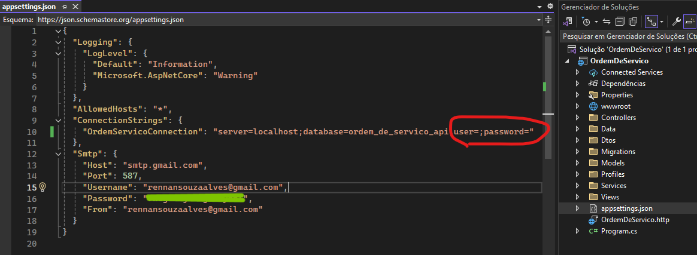

# TVVS_OrdemServico

A organização do projeto Ordem de serviço será realizada da seguinte forma:

- A documentação técnica, o backlog do produto, o dicionário de dados, o código fonte, bem como os exemplos de uso estarão reunidos e organizados sob o diretório do sistema Ordem de Serviço. 
- A verificação dos artefatos e a validação de usabilidade virão em diretórios distintos ao do sistema (na raiz principal do repositório).
- Os diagramas do projeto estarão reunidos sob o diretório da documentação técnica.
- As User Stories estarão disponíveis na guia Projects.

<h1>Manual de Instalação e Configuração do Projeto OS</h1>

  <h2>1. Requisitos de Sistema</h2>
  
Antes de iniciar, certifique-se de que seu sistema atenda aos seguintes requisitos:

  <ul>
      <li>Windows 10 ou superior</li>
      <li>Conexão com a internet para baixar as ferramentas necessárias</li>
  </ul>

  <h2>2. Instalando o Visual Studio 2022</h2>
  <ol>
      <li>Visite o site oficial do Visual Studio clicando no link abaixo:</li>
      <a href="https://visualstudio.microsoft.com/pt-br/downloads/">https://visualstudio.microsoft.com/pt-br/downloads/</a>
      <li>Na página de downloads, escolha a versão <strong>Community</strong> (gratuita) e clique em <strong>Download</strong>.</li>
      <li>Após o download, abra o instalador e siga as instruções na tela.</li>
      <li>Durante a instalação, selecione a carga de trabalho <strong>Desenvolvimento ASP.NET e Web</strong>.</li>
      <li>Aguarde até que a instalação seja concluída e o Visual Studio esteja pronto para uso.</li>
  </ol>

  <h2>3. Instalando o MySQL e MySQL Workbench</h2>
  <ol>
      <li>Visite o site oficial do MySQL clicando no link abaixo:</li>
      <a href="https://dev.mysql.com/downloads/installer/">https://dev.mysql.com/downloads/installer/</a>
      <li>Na página de downloads, escolha a opção <strong>MySQL Installer for Windows</strong> e clique em <strong>Download</strong>.</li>
      <li>Após o download, abra o instalador do MySQL.</li>
      <li>No instalador, selecione a opção <strong>Developer Default</strong>, que instalará o MySQL Server e o MySQL Workbench juntos.</li>
      <li>Siga as instruções na tela para configurar o MySQL Server:</li>
      <ul>
          <li>Escolha o tipo de instalação como <strong>Standalone MySQL Server</strong>.</li>
          <li>Defina a senha do usuário root (guarde essa senha, pois será necessária posteriormente).</li>
          <li>Complete as demais configurações padrão.</li>
      </ul>
      <li>Conclua a instalação e inicie o MySQL Workbench.</li>
  </ol>

  <h2>4. Baixando o Projeto do GitHub</h2>
  
Agora que você já tem o ambiente configurado, o próximo passo é baixar o projeto. Você pode fazer isso de duas formas:

  
  <h3>4.1 Baixar com Git</h3>
  <ol>
      <li>Abra o terminal ou o Git Bash.</li>
      <li>Navegue até a pasta de sua preferência onde deseja salvar o projeto.</li>
      <li>Digite o seguinte comando para clonar o repositório:</li>
      <pre><code>git clone https://github.com/arsouza81/TVVS_OrdemServico.git</code></pre>
      <li>Aguarde até que o processo de clonagem seja concluído.</li>
  </ol>
  
  <h3>4.2 Baixar como arquivo zipado</h3>
  <ol>
      <li>Acesse o repositório através do link:</li>
      <a href="https://github.com/arsouza81/TVVS_OrdemServico">https://github.com/arsouza81/TVVS_OrdemServico</a>
      <li>Na página do repositório, clique no botão <strong>Code</strong>.</li>
      <li>Selecione a opção <strong>Download ZIP</strong>.</li>
      <li>Após o download, extraia o arquivo ZIP em uma pasta de sua preferência.</li>
  </ol>

  <h3>Imagem do site</h3>
  
Abaixo está uma imagem de como o site do GitHub aparecerá para você ao seguir essas instruções:

  

  <h2>5. Abrindo o Projeto no Visual Studio</h2>

Agora que o projeto já foi baixado, o próximo passo é abri-lo no Visual Studio. Siga as instruções abaixo:

<h3>5.1 Abrir o Projeto</h3>
<ol>
    <li>Abra o Visual Studio 2022.</li>
    <li>Na tela inicial, clique em <strong>Abrir um projeto ou solução</strong>.</li>
    <li>Veja a imagem abaixo para referência:</li>
    
</ol>

<h3>5.2 Selecionar o Projeto</h3>
<ol>
    <li>Navegue até a pasta onde você baixou o projeto.</li>
    <li>Selecione o arquivo da solução <strong>.sln</strong> correspondente ao projeto e clique em <strong>Abrir</strong>.</li>
    <li>Veja a imagem abaixo para referência:</li>
    
</ol>

<h2>6. Configurando o appsettings.json</h2>

Agora que o projeto está aberto no Visual Studio, o próximo passo é configurar o arquivo <strong>appsettings.json</strong> para ajustar as credenciais de conexão com o banco de dados.

<ol>
    <li>No Visual Studio, localize o arquivo <strong>appsettings.json</strong> na árvore de arquivos do projeto.</li>
    <li>Abra o arquivo e encontre a seção <strong>ConnectionStrings</strong>.</li>
    <li>Substitua <strong>Username</strong> e <strong>Password</strong> pelas suas credenciais do MySQL.</li>
    <li>Veja a imagem abaixo para referência:</li>
    
</ol>

<h2>7. Abrindo o Gerenciador de Pacotes NuGet</h2>

Para realizar as migrações do banco de dados, precisamos usar o Gerenciador de Pacotes NuGet. Siga os passos abaixo para abrir o gerenciador:

<ol>
    <li>No Visual Studio, vá até o menu <strong>Ferramentas</strong> (Tools) e selecione <strong>Gerenciador de Pacotes NuGet</strong>.</li>
    <li>Clique em <strong>Console do Gerenciador de Pacotes</strong> (Package Manager Console).</li>
    <li>Veja a imagem abaixo para referência:</li>
    
</ol>

<h2>8. Atualizando o Banco de Dados</h2>

Com o Gerenciador de Pacotes NuGet aberto, você pode agora atualizar o banco de dados com as migrações. Siga os passos abaixo:

<h3>8.1 Criando uma Migração</h3>
<ol>
    <li>Na <strong>Console do Gerenciador de Pacotes</strong>, digite o seguinte comando para criar uma migração:</li>
    <pre><code>Add-Migration NomeDaMigracao</code></pre>
    <li>Veja a imagem abaixo para referência:</li>
    
</ol>

<h3>8.2 Atualizando o Banco de Dados</h3>
<ol>
    <li>Após criar a migração, digite o seguinte comando para atualizar o banco de dados:</li>
    <pre><code>Update-Database</code></pre>
    <li>Veja a imagem abaixo para referência:</li>
    
</ol>

<h2>9. Iniciando o Projeto</h2>

Agora que todas as configurações foram feitas, o último passo é iniciar o projeto. Siga as instruções abaixo:

<h3>9.1 Executando o Projeto</h3>
<ol>
    <li>Certifique-se de que o Visual Studio está configurado para rodar o projeto em <strong>https</strong>.</li>
    <li>Para iniciar o projeto, clique no botão <strong>Play</strong> no Visual Studio. O projeto será iniciado automaticamente no navegador padrão.</li>
    <li>Veja a imagem abaixo para referência:</li>
    
</ol>

<h3>9.2 Resolução de Problemas de Autorização</h3>
<ol>
    <li>Se encontrar erros relacionados à autorização ou execução no navegador padrão, você pode tentar executar o projeto em outro navegador.</li>
    <li>Copie o link do navegador que abriu e cole em outro navegador, como o Chrome ou Firefox.</li>
    <li>Veja a imagem abaixo para referência:</li>
    
</ol>

Com isso, o projeto estará rodando corretamente, e você poderá acessar as funcionalidades disponíveis.

